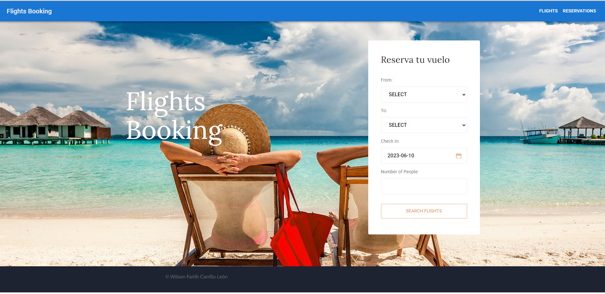

# flight-booking-app
Aplicación de reserva de vuelos que permite a los usuarios buscar vuelos, seleccionar uno y realizar una reserva.

## Tabla de Contenidos

- [Características](#características)
- [Requisitos Previos](#requisitos-previos)
- [Instalación](#instalación)
- [Uso](#uso)
- [Contribución](#contribución)
- [Licencia](#licencia)

## Características

Enumera las principales características y funcionalidades del proyecto.

- Casos de uso: Aplicación de reserva de vuelos
- Obejtivo: Desarrollar una aplicación de reserva de vuelos que permita a los usuarios buscar vuelos, seleccionar uno y realizar una reserva.

## Requisitos Previos

Tecnologias y herramientas necesarias para la ejecuciondel proyecto

- Nodejs: https://nodejs.org/es
- npm: Al instalar node se pueden instalar los paguetes de npm
- Reactjs: https://es.react.dev/
- Postgresql: https://www.postgresql.org/
- GIT: https://git-scm.com/
 

## Instalación

A continuacion se explican los pasos necesarios para instalar y configurar el proyecto.
Abrir una terminal de comandos y pararnos en la ruta donde se desee clonar el repositorio
1. clonar el repositorio: 
>git clone https://github.com/Farithcarrillo/flight-booking-app.git

2. Verificar que se tenga instalado postgreSQL, en caso que no, instalarlo (Se recomienda uso de pgAdmin si se tiene dificultad de SQL)

3. Abrir consola de comandos sql, o pgAdmin e ingresar a servidor de base de datos (Esto con el usuario master que se tenga para postgreSQL)

4. Una vez se haya iniciado sesion, seguir paso a paso del archivo [SQL](database/db.sql)

5. Seguido a la creación de la base de datos, ingresar al proyecto clonado. Se encontraran dentro de el 3 carpetas
    - database (Información SQL para la creación de base de datos)
    - flight-booking-backend (Backend de la apliación con Nodejs)
    - flight-booking-frontend (Frontend de la apliación con Nodejs)

6. Ingresar a la carpeta flight-booking-backend
>cd flight-booking-backend

Seguido a esto vamos a correr el siguiente comando para instalar los modulos de node necesarios:
>npm install

Posterior procedemos a arrancar el servicio backend del proyecto:
>npm run dev

7. Regresar a la carpeta raiz del proyecto
>cd ..

8. Ingresar a la carpeta flight-booking-frontend
>cd flight-booking-frontend

Seguido a esto vamos a correr el siguiente comando para instalar los modulos de node necesarios:
>npm install

Posterior procedemos a arrancar el servicio frontend del proyecto:
>npm start

9. La aplicación esta lista para usarse localmente

## Uso

- El proyecto tiene una pantalla principal para busqueda de vuelos:

Esta pantalla nos permite filtrar la busqueda de un vuelo que se quiera reservar como usuario. Esta posee los campos (Todos Obligatorios):
- From: que es un listado de las ciudades donde salen vuelos.
- To: que es un listado de las ciudades donde terminan vuelos.
- Check In: Que es la fecha del viajes.
- Number of people: El numero de personas que estaran en la reserva.